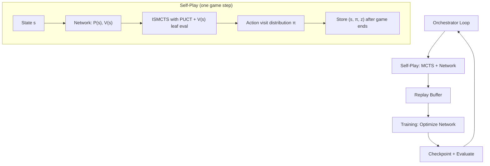

# AlphaZero-style Expert Iteration for Regicide

Implement Phase 5 from the [expert_iteration_plan.md](file:///c:/Users/modin/Desktop/programming/GAMES/Regicide/planning/expert_iteration_plan.md): a synchronous AlphaZero / Expert Iteration loop where ISMCTS acts as the "Expert" (System 2) and a custom PyTorch dual-headed neural network acts as the "Apprentice" (System 1).

## Architecture Overview



## Key Design Decisions

### 1. State Representation (Network Input)

The existing [NumericObsWrapper](file:///c:/Users/modin/Desktop/programming/GAMES/Regicide/solvers/wrappers.py) converts observations into numeric form for SB3. We will build a **new, richer featurizer** that is independent of SB3 and operates directly on the `env.game` object (no gym wrapper needed inside the MCTS loop). This is critical for speed since the network will be called thousands of times per game during search.

**Proposed feature vector** (all visible information, ~30 floats):

| Feature | Dim | Notes |
|---|---|---|
| Hand cards: value (normalized) | 8 | `card.value / 13.0`, 0 if empty slot |
| Hand cards: suit (one-hot) | 8×4=32 | 4 suits per card slot |
| Enemy HP remaining (normalized) | 1 | `(health - damage_taken) / 40.0` |
| Enemy attack (normalized) | 1 | `attack / 20.0` |
| Enemy suit (one-hot) | 4 | |
| Enemy spade protection (normalized) | 1 | `spade_protection / 20.0` |
| Jester immunity cancelled | 1 | binary |
| Phase: is defense | 1 | binary |
| Required defense (normalized) | 1 | `required_defense / 20.0` |
| Tavern deck size (normalized) | 1 | `len(tavern) / 40.0` |
| Discard pile size (normalized) | 1 | `len(discard) / 52.0` |
| Castle enemies remaining (normalized) | 1 | `len(castle) / 12.0` |
| Hand size (normalized) | 1 | `len(hand) / 8.0` |
| Can yield | 1 | binary |
| Solo jesters remaining | 1 | `remaining / 2.0` |
| **Total** | **~56** | |

> [!IMPORTANT]
> **Open question: Embedding vs. flat features?** The existing [architecture.py](file:///c:/Users/modin/Desktop/programming/GAMES/Regicide/solvers/architecture.py) uses `nn.Embedding` for card values/suits. Embeddings are great but add complexity. I propose starting with the flat normalized features above (simpler, faster during MCTS inference). We can always upgrade to embeddings later as an ablation. Do you agree?

### 2. Action Representation (Network Output)

The env already defines 256 possible actions via the 8-bit card mask (2^8 = 256 combinations). The action space is `Discrete(256)`, and valid actions are tracked via `action_mask` in the observation.

**Policy head output**: a 256-logit vector. During MCTS, we mask invalid actions and softmax the remaining logits to get prior probabilities $P(s, a)$.

This directly reuses the existing [action_mask](file:///c:/Users/modin/Desktop/programming/GAMES/Regicide/solvers/env.py#L74-L80) infrastructure. Inside the MCTS node, we store action tuples (the 8-element list), and convert to/from index `0-255` using the existing bit-packing.

### 3. Neural Network Architecture

A simple MLP dual-headed network (no CNN/Transformer needed for this state size):

```
Input (56 floats)
    │
    ├─ Shared Trunk: Linear(56→256) → ReLU → Linear(256→256) → ReLU
    │
    ├─ Policy Head: Linear(256→256) → ReLU → Linear(256→256) → softmax (masked)
    │
    └─ Value Head: Linear(256→128) → ReLU → Linear(128→1) → tanh
```

**Value range**: `tanh` outputs in `[-1, 1]`. We normalize the game outcome to this range:
- Win = `+1.0`
- Loss = `-1.0`
- (Optional) progress-based: `(enemies_defeated / 12) * 2 - 1` to give a gradient signal even in losses.

### 4. MCTS Upgrade: PUCT + Network Bootstrapping

The current [ISMCTSAgent](file:///c:/Users/modin/Desktop/programming/GAMES/Regicide/solvers/agents/ismcts_agent.py) uses UCB1 with availability counts and heuristic rollouts. The new `AlphaZeroISMCTSAgent` will:

1. **Replace rollouts with network value evaluation**: When a leaf node is reached, call `network(state)` → `(policy_priors, value)`. Use `value` directly instead of rolling out to the end of the game.
2. **Replace UCB1 with PUCT**: At each node, select the action that maximizes:
   $$a^* = \arg\max_a \left[ Q(s,a) + c_{\text{puct}} \cdot P(s,a) \cdot \frac{\sqrt{N(s)}}{1 + N(s,a)} \right]$$
   where $P(s,a)$ is the prior probability from the network's policy head.
3. **Keep determinization + ISMCTS structure**: We still sample determinizations and handle the information-set nature of the game. The PUCT formula replaces UCB1 but the availability-count mechanism for subset-armed bandits is preserved.

> [!IMPORTANT]
> **Open question: Hybrid rollouts?** Pure value-head evaluation works great once the network is trained, but at the very start (random network), it gives garbage values. Option A: Start with pure heuristic rollouts (Phase 2 behavior) and switch to network eval after N training iterations. Option B: Always use network eval (the MCTS visit counts will still produce reasonable policies even with a bad value head, since the exploration term dominates early on). I recommend **Option B** for simplicity — the AlphaZero paper shows this works. Thoughts?

### 5. Self-Play Data Generation

Each self-play game produces a list of training samples. We collect:
- **state**: The feature vector at decision time
- **policy target (π)**: The MCTS visit-count distribution over all 256 actions (normalized to sum to 1). Actions not visited get 0. This is the "expert" signal.
- **value target (z)**: The final game outcome (+1 win, -1 loss), applied retroactively to all states in the game.

After each game, we write all `(state, π, z)` tuples into a **replay buffer**.

### 6. Training Loop

**Loss function** (standard AlphaZero):
$$\mathcal{L} = \underbrace{(z - v)^2}_{\text{Value MSE}} - \underbrace{\pi^T \log p}_{\text{Policy Cross-Entropy}} + \underbrace{c \|\theta\|^2}_{\text{L2 Regularization}}$$

**Training schedule** (synchronous loop):
1. Play `N` self-play games (e.g., 100 games per iteration)
2. Add all `(s, π, z)` to replay buffer (fixed-size sliding window, e.g., last 50k samples)
3. Train network for `K` epochs over `M` mini-batches sampled from the buffer
4. Save checkpoint, run quick evaluation (e.g., 50 games with greedy network-only policy)
5. Repeat

### 7. Temperature Schedule

During self-play, the MCTS visit counts are converted to a policy using temperature:
$$\pi(a) = \frac{N(a)^{1/\tau}}{\sum_b N(b)^{1/\tau}}$$

- **τ = 1.0** for the first ~15 moves (exploration, diverse training data)
- **τ → 0** (argmax) for later moves (exploitation, realistic play)

---

## Proposed Changes

### New Module: `solvers/alphazero/` (all new files)

This is the core of the implementation. Placing it in a new subpackage keeps it cleanly separated from the existing ISMCTS/PPO code.

#### [NEW] [featurizer.py](file:///c:/Users/modin/Desktop/programming/GAMES/Regicide/solvers/alphazero/featurizer.py)
- `encode_state(env) → np.ndarray` — Converts a `RegicideEnv` into the flat feature vector described above.
- `action_mask_to_index(mask) → int` and `index_to_action_mask(idx) → list` — Bidirectional conversion between the 8-element binary mask and the 0-255 action index.

#### [NEW] [network.py](file:///c:/Users/modin/Desktop/programming/GAMES/Regicide/solvers/alphazero/network.py)
- `RegicideNet(nn.Module)` — The dual-headed PyTorch network.
  - `forward(state_tensor) → (policy_logits, value)`
  - `predict(state_tensor, action_mask) → (priors, value)` — Convenience method that applies masking and softmax to policy logits.

#### [NEW] [mcts.py](file:///c:/Users/modin/Desktop/programming/GAMES/Regicide/solvers/alphazero/mcts.py)
- `PUCTNode` — MCTS node with prior probability, Q-values, visit counts, and availability counts (preserving the ISMCTS mechanism).
- `run_mcts(env, network, n_simulations, temperature, c_puct) → policy_vector` — Runs ISMCTS with PUCT selection and network leaf evaluation. Returns the 256-dim visit-count policy.

#### [NEW] [replay_buffer.py](file:///c:/Users/modin/Desktop/programming/GAMES/Regicide/solvers/alphazero/replay_buffer.py)
- `ReplayBuffer(max_size)` — Fixed-size circular buffer storing `(state, policy, value)` tuples. Supports random mini-batch sampling.

#### [NEW] [trainer.py](file:///c:/Users/modin/Desktop/programming/GAMES/Regicide/solvers/alphazero/trainer.py)
- `AlphaZeroTrainer` — Owns the network, optimizer, and training loop.
  - `train_step(batch) → loss_dict` — One gradient update.
  - `save_checkpoint(path)` / `load_checkpoint(path)` — Model persistence.

#### [NEW] [self_play.py](file:///c:/Users/modin/Desktop/programming/GAMES/Regicide/solvers/alphazero/self_play.py)
- `run_self_play_game(env, network, mcts_config) → List[(state, policy, outcome)]` — Plays one full game using MCTS+Network, returning training data.
- `generate_self_play_data(n_games, network, mcts_config) → ReplayBuffer` — Batch wrapper.

#### [NEW] [orchestrator.py](file:///c:/Users/modin/Desktop/programming/GAMES/Regicide/solvers/alphazero/orchestrator.py)
- `AlphaZeroOrchestrator` — The main loop that ties everything together:
  1. Self-play → generate data
  2. Train network
  3. Evaluate
  4. Log metrics + save checkpoint
  5. Repeat
- Uses the existing [RunLogger](file:///c:/Users/modin/Desktop/programming/GAMES/Regicide/solvers/logger.py) for logging and [ParallelSimulator](file:///c:/Users/modin/Desktop/programming/GAMES/Regicide/solvers/parallel.py) for evaluation.

#### [NEW] [config.py](file:///c:/Users/modin/Desktop/programming/GAMES/Regicide/solvers/alphazero/config.py)
- Dataclass holding all hyperparameters (n_simulations, c_puct, learning_rate, buffer_size, batch_size, temperature schedule, etc.)

#### [NEW] [\_\_init\_\_.py](file:///c:/Users/modin/Desktop/programming/GAMES/Regicide/solvers/alphazero/__init__.py)

---

### New Agent: `solvers/agents/`

#### [NEW] [alphazero_agent.py](file:///c:/Users/modin/Desktop/programming/GAMES/Regicide/solvers/agents/alphazero_agent.py)
- `AlphaZeroAgent(BaseAgent)` — A deployable agent that loads a trained network checkpoint and uses MCTS+PUCT for play. Plugs into the existing [benchmark.py](file:///c:/Users/modin/Desktop/programming/GAMES/Regicide/benchmark.py) and evaluation infrastructure.

---

### Entry Point

#### [NEW] [train_alphazero.py](file:///c:/Users/modin/Desktop/programming/GAMES/Regicide/train_alphazero.py)
- CLI entry point that loads config, creates the orchestrator, and runs the training loop.
- Supports `--resume` for checkpoint resumption.

---

### Config

#### [MODIFY] [config.yaml](file:///c:/Users/modin/Desktop/programming/GAMES/Regicide/config.yaml)
- Add an `alphazero:` section with default hyperparameters.

---

## Open Questions

> [!IMPORTANT]
> **1. Flat features vs. Embeddings?** Start with flat normalized features (simpler, faster in MCTS loop) and upgrade later? Or use the embedding approach from [architecture.py](file:///c:/Users/modin/Desktop/programming/GAMES/Regicide/solvers/architecture.py) from the start?

> [!IMPORTANT]
> **2. Hybrid rollouts vs. pure network eval?** Start with pure network evaluation at leaf nodes (Option B, simpler, follows AlphaZero paper), or start with heuristic rollouts and transition to network eval (Option A, more stable early on)?

> [!IMPORTANT]
> **3. Value target: binary outcome vs. progress-based?** Use `+1/-1` for win/loss (AlphaZero standard), or use `(enemies_defeated/12)*2 - 1` to give gradient signal on partial progress (better for a hard game where wins are rare early on)? I lean toward progress-based initially, switching to binary once the agent starts winning.

> [!IMPORTANT]
> **4. MCTS simulation budget?** Current ISMCTS uses 1000 iterations per decision. With network inference in the loop, this will be slower. Start with ~50-100 simulations during self-play (AlphaZero used 800 for Go, but our game is much simpler)? We can sweep this later.

## Verification Plan

### Automated Tests
- **Unit tests** for featurizer (round-trip encoding, edge cases like empty hand).
- **Unit tests** for MCTS (verify PUCT selection, prior propagation, determinization).
- **Smoke test**: Run 1 iteration of the full loop (1 self-play game → 1 training step) and verify loss decreases.
- `python -m pytest tests/` — existing tests still pass (no regressions).

### Manual Verification
- Run the training loop for ~10 iterations, inspect TensorBoard / logged metrics to verify:
  - Policy loss decreases over iterations.
  - Value loss decreases over iterations.
  - Average enemies defeated trends upward.
- Compare `AlphaZeroAgent` vs. `ISMCTSAgent` vs. `HeuristicAgent` via `benchmark.py`.
