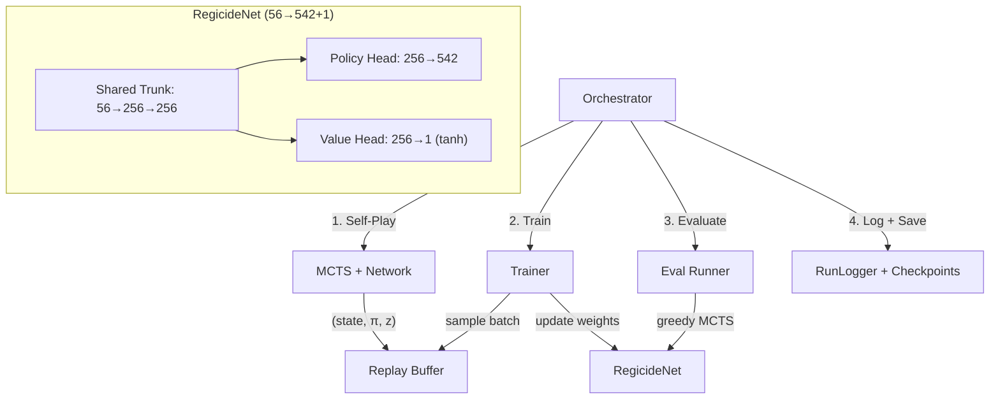

# AlphaZero Expert Iteration — Implementation Walkthrough

## Summary

Implemented Phase 5 of the [expert_iteration_plan.md](file:///c:/Users/modin/Desktop/programming/GAMES/Regicide/planning/expert_iteration_plan.md): a complete AlphaZero-style Expert Iteration system for Regicide. The system uses ISMCTS with PUCT selection and neural network leaf evaluation as the "Expert" and a custom dual-headed PyTorch MLP as the "Apprentice".

## New Files Created

### Core Module: `solvers/alphazero/`

| File | Purpose |
|---|---|
| [\_\_init\_\_.py](file:///c:/Users/modin/Desktop/programming/GAMES/Regicide/solvers/alphazero/__init__.py) | Module init |
| [config.py](file:///c:/Users/modin/Desktop/programming/GAMES/Regicide/solvers/alphazero/config.py) | `AlphaZeroConfig` dataclass — all hyperparameters in one place |
| [featurizer.py](file:///c:/Users/modin/Desktop/programming/GAMES/Regicide/solvers/alphazero/featurizer.py) | `encode_state(env) → 56-dim vector` + action index converters for the 542 action space |
| [network.py](file:///c:/Users/modin/Desktop/programming/GAMES/Regicide/solvers/alphazero/network.py) | `RegicideNet` — dual-headed MLP (542-logit policy head + tanh value head) |
| [mcts.py](file:///c:/Users/modin/Desktop/programming/GAMES/Regicide/solvers/alphazero/mcts.py) | `PUCTNode` + `run_mcts()` — ISMCTS with PUCT formula, network leaf eval, Dirichlet noise |
| [replay_buffer.py](file:///c:/Users/modin/Desktop/programming/GAMES/Regicide/solvers/alphazero/replay_buffer.py) | `ReplayBuffer` — fixed-size circular buffer with random batch sampling |
| [self_play.py](file:///c:/Users/modin/Desktop/programming/GAMES/Regicide/solvers/alphazero/self_play.py) | `run_self_play_game()` — plays games with MCTS+Network, records `(state, π, z)` |
| [trainer.py](file:///c:/Users/modin/Desktop/programming/GAMES/Regicide/solvers/alphazero/trainer.py) | `AlphaZeroTrainer` — gradient updates, AlphaZero loss, checkpoint I/O |
| [eval.py](file:///c:/Users/modin/Desktop/programming/GAMES/Regicide/solvers/alphazero/eval.py) | `evaluate_network()` — runs greedy MCTS games for benchmarking |
| [orchestrator.py](file:///c:/Users/modin/Desktop/programming/GAMES/Regicide/solvers/alphazero/orchestrator.py) | `AlphaZeroOrchestrator` — main training loop (self-play → train → eval → log) |

### Agent & Entry Point

| File | Purpose |
|---|---|
| [alphazero_agent.py](file:///c:/Users/modin/Desktop/programming/GAMES/Regicide/solvers/agents/alphazero_agent.py) | `AlphaZeroAgent(BaseAgent)` — loads a checkpoint for play, compatible with benchmark.py |
| [train_alphazero.py](file:///c:/Users/modin/Desktop/programming/GAMES/Regicide/train_alphazero.py) | CLI entry point with argument parsing |

## Modified Files

| File | Change |
|---|---|
| [config.yaml](file:///c:/Users/modin/Desktop/programming/GAMES/Regicide/config.yaml) | Added `alphazero:` section with default hyperparameters |

## Architecture Diagram



## Key Design Decisions

- **542-action space**: Respects the new global action representation (286 attack + 256 defense)
- **Flat 56-dim features**: Fast for MCTS inference, no embeddings (upgradeable later)
- **PUCT with availability counts**: Preserves the ISMCTS subset-armed-bandit mechanism
- **Network leaf evaluation (no rollouts)**: Pure Option B from the plan
- **Progress-based value targets**: `enemies_defeated/12 * 2 - 1` in [-1, 1]
- **Temperature schedule**: τ=1.0 for first 15 moves, then argmax

## Verification

Ran a full smoke test: 2 iterations × 50 self-play games × 5 MCTS sims/move + 3 eval games.

| Phase | Result |
|---|---|
| Self-Play (iter 1) | 344 samples from 50 games in 10.8s |
| Self-Play (iter 2) | 407 samples from 50 games in 13.2s |
| Training (iter 2) | 230 batches in 1.1s — PolicyL=3.9351, ValueL=0.0607 |
| Evaluation | Avg 1.00/12 enemies, 0% win rate (3 games, random network) |
| Checkpoint | ✅ Saved successfully |

## Usage

```bash
# Default run (50 sims, 100 games/iter, 100 iterations, CPU)
python train_alphazero.py

# Quick test
python train_alphazero.py --sims 10 --games 20 --iterations 5 --eval-games 5

# Full run on GPU
python train_alphazero.py --sims 100 --games 200 --iterations 200 --device cuda

# Resume from checkpoint
python train_alphazero.py --resume runs/alphazero/alphazero/models/alphazero_latest_iter50
```
